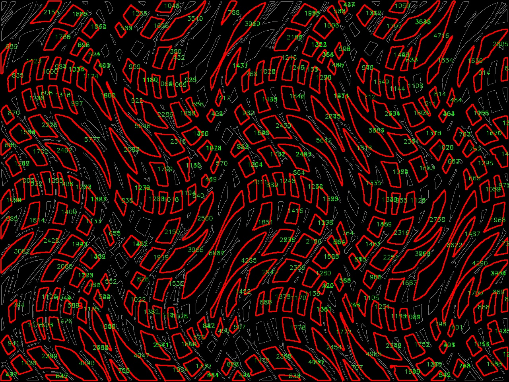

# Fibre Pore Size Measurement

 Pore size program based on <code>opencv</code>, <code>skimage</code> and <code>pytorch</code>. The program measures pore sizes among fibre net in pixel and returns basic statistical analysis and a pore labelled image.

## Example

 An measurement example is shown above, pores and pore size are labelled on the image. It's noticeable that some pores are not labelled, this is the shortcomings of the program right now, but it's believed that the general statistical characteristics wouldn't affected. 

## Usage

 Move all files to the root path of the project, import <code>poresMeasure</code> via: 

    import poresmeasure

 Activate module via: 

    poresMeasure.setup()

 Result and viusalisation can be done via: 

    areas, resultImg = poresMeasure.measure(imgPath)

    poresMeasure.resultAnalyse(areas)

## License

 This project is released under Apache2.0 license. 
